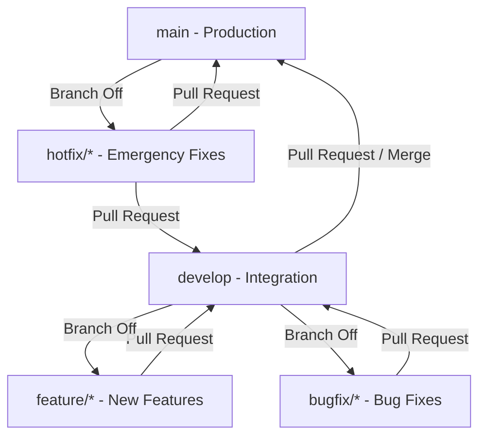

# Zyro Git Workflow & Branching Strategy

This document defines the official repository branching model, merge rules, and deployment pipelines for Zyro. Following this lightweight strategy ensures stable development, linear history, and production safety for our startup MVP.

---

## 1. Repository Branching Model

We use a simple, dual-trunk branching structure designed for rapid iteration with a high quality bar.



### Branch Purviews

| Branch | Purview | Target Environment | Deployment Policy |
| :--- | :--- | :--- | :--- |
| `main` | Production-only code. Must always be deployable and stable. | Production (`zyro.app`) | Continuous Deployment (Vercel) upon push/merge. |
| `develop` | Integration branch where finished features are consolidated. | Staging / Pre-release | Continuous Integration & preview build verification. |
| `feature/*` | Feature development. Isolated workspaces. | Local / Preview Sandbox | Automated previews generated per PR target. |
| `bugfix/*` | Non-emergency defect corrections. | Local / Preview Sandbox | Automated previews generated per PR target. |
| `hotfix/*` | Critical production issues bypassed from develop. | Production & Develop | Auto-deploys to production on merge to `main`. |

---

## 2. Naming Conventions

All branch names must follow these strict patterns to maintain readability and integration traceabilities:

*   **Features:** `feature/kebab-case-description`
    *   *Correct:* `feature/offer-letter-generation`, `feature/ZYRO-102-admin-search`
    *   *Incorrect:* `feature/addAuth`, `feat-ui`, `feature_dashboard`
*   **Bugfixes:** `bugfix/kebab-case-description`
    *   *Correct:* `bugfix/signup-loading-spinner`, `bugfix/rls-policy-patch`
    *   *Incorrect:* `bug/fix-something`, `fix-profile`
*   **Hotfixes:** `hotfix/kebab-case-description`
    *   *Correct:* `hotfix/expired-resend-key`, `hotfix/security-bypass`
    *   *Incorrect:* `hotfix`, `emergency-patch`

---

## 3. Standard Workflows & Git Commands

### A. Developing a Feature or Normal Bugfix

All development branches branch off `develop` and merge back into `develop` through a pull request.

1.  **Synchronize develop:**
    ```bash
    git checkout develop
    git pull origin develop
    ```
2.  **Create your workspace branch:**
    ```bash
    git checkout -b feature/your-feature-name
    ```
3.  **Implement, format, and verify changes locally:**
    Ensure you run the local typecheck and lint checks before committing:
    ```bash
    npm run build
    npm run lint
    ```
4.  **Commit with conventional structure:**
    ```bash
    git add .
    git commit -m "feat: add digital signature fields to offer letter template"
    ```
5.  **Publish your branch:**
    ```bash
    git push -u origin feature/your-feature-name
    ```
6.  **Create Pull Request:** Open a PR on GitHub targeting the **`develop`** branch.
7.  **Review & Merge:** Once CI checks pass and reviews are approved, perform a **Squash and Merge**.

---

### B. Emergency Production Hotfix

Hotfixes bypass `develop` and are branched directly from `main` to address critical live issues.

1.  **Check out main and pull the latest production state:**
    ```bash
    git checkout main
    git pull origin main
    ```
2.  **Create your hotfix branch:**
    ```bash
    git checkout -b hotfix/critical-bug-description
    ```
3.  **Fix the issue and commit locally:**
    ```bash
    # Apply fix
    npm run build
    npm run lint
    git commit -m "fix: resolve critical auth token expiry error"
    ```
4.  **Publish and create PR to `main`:**
    ```bash
    git push -u origin hotfix/critical-bug-description
    ```
    *Open a pull request from `hotfix/...` targeting `main`.*
5.  **Merge and Deploy:** Once merged, Vercel will auto-deploy the patch to production.
6.  **Backport to `develop`:** You **must** sync the fix back into the active integration line:
    *Open a second pull request from `hotfix/...` targeting `develop` (or merge main into develop).*
    ```bash
    git checkout develop
    git pull origin develop
    git merge main
    git push origin develop
    ```

---

## 4. Code Quality & Definition of Done (DoD)

Before any branch can be merged into `develop` or `main`, it must meet the following criteria:

*   [ ] **No Linting Errors:** ESLint passes with zero warnings or errors.
*   [ ] **Strict Type-Safety:** TypeScript type-checks compile with zero errors (`tsc -b` / `tsc --noEmit`).
*   [ ] **Successful Build:** Vite production build compiles successfully.
*   [ ] **Database Integrity:** SQL migrations have no sequence gaps and contain zero dangerous patterns.
*   [ ] **Access Auditing:** RLS (Row Level Security) is verified on all new/updated tables.
*   [ ] **Review Sign-off:** PR is reviewed and approved (by self if solo, or by teammates).
*   [ ] **No Placeholders:** Hardcoded strings or unimplemented UI pages/components are not allowed.

---

## 5. Merging Strategy & Linear History

*   **PRs to `develop`:** Use **Squash and Merge**. This compresses feature branches into a single clean commit on `develop`, maintaining a clean commit history.
*   **PRs to `main` (`develop` -> `main` Release):** Use **Create a Merge Commit** or **Rebase and Merge**. This preserves the history of integration points and makes it easy to track individual feature releases.
*   **Commit Format:** Always use conventional prefixes:
    *   `feat:` (new features)
    *   `fix:` (defect corrections)
    *   `docs:` (documentation updates)
    *   `chore:` (dependencies, configurations, CI changes)

---

## 6. Suggested GitHub Settings

Configure these rules in **Settings → Branches** to safeguard the repository branch structure:

### Branch Protection Rules for `main` and `develop`

| Rule Option | Target Branch | Rationale |
| :--- | :--- | :--- |
| **Require a pull request before merging** | `main` & `develop` | Prevents direct pushes and enforces code review/audits. |
| **Require status checks to pass** | `main` & `develop` | Restricts merging unless ESLint, TypeScript compilation, and build pass. |
| **Require branches to be up to date** | `main` | Protects production from regressions caused by outdated integration baselines. |
| **Require linear history** | `main` & `develop` | Enforces a flat, readable Git log without confusing merge loops. |
| **Restrict force pushes** | `main` & `develop` | Blocks destructive rewrites of shared commit history. |
| **Restrict deletions** | `main` & `develop` | Protects long-lived trunk branches from deletion. |

### Repository Merge Settings
*   **Allow Squash Merging:** Enabled (default for feature branches).
*   **Allow Rebase Merging:** Enabled (optional, for release merges).
*   **Allow Merge Commits:** Enabled (only for `develop` -> `main` releases).
*   **Default Branch:** It is recommended to keep `develop` as the default branch on GitHub, so new Pull Requests target `develop` by default.

---

## 7. Common Mistakes & Recovery Procedures

### 1. Accidentally Committed Directly to `develop` or `main` (Local)
If you made changes on the wrong branch but have not pushed them:
```bash
# 1. Stash changes if you haven't committed them yet
git stash

# 2. If already committed, undo the commits (keeping changes staged)
git reset --soft HEAD~1

# 3. Create and switch to your feature branch
git checkout -b feature/correct-branch-name

# 4. Pop the stash to apply your changes
git stash pop
```

### 2. Resolving Merge Conflicts with `develop`
If your feature branch is out of sync and has conflicts:
```bash
# 1. Fetch latest changes
git fetch origin

# 2. Check out your feature branch
git checkout feature/your-feature-name

# 3. Merge develop into your feature branch to resolve conflicts locally
git merge origin/develop

# 4. Resolve the conflicts in your IDE, stage the resolved files, and commit:
git add .
git commit -m "chore: resolve merge conflicts with develop"
```
